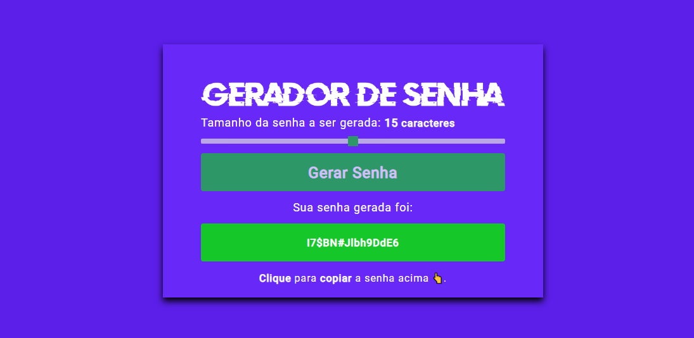

# Password Generator
 Apresentação de um gerador de senha online

 

## 🖥️ O Projeto
Esse é projeto básico aplicado HTML + CSS + JS para gerar senhas aleatórias.
 
 

## 🚀 Tecnologias
Esse protótipo foi desenvolvido com as seguintes tecnologias:

- HTML5
- CSS3
- JS
- Git e Github